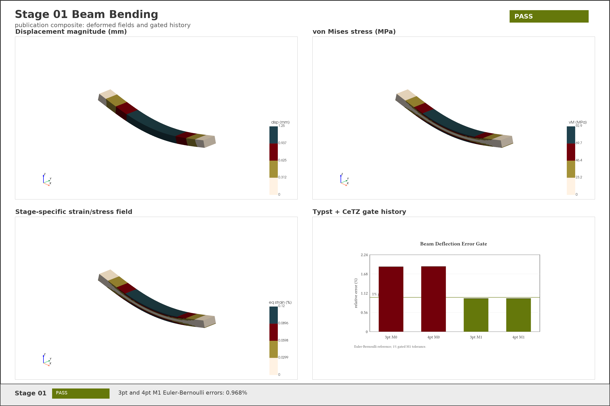
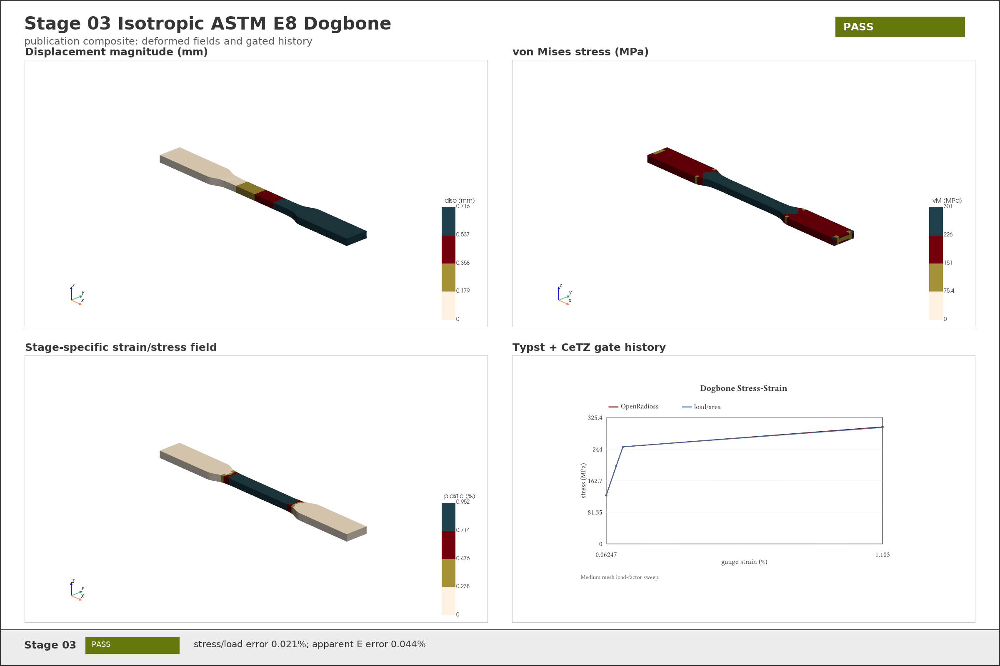
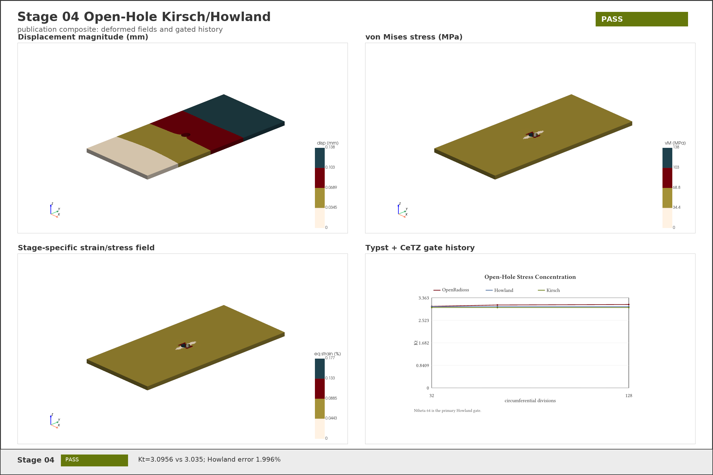
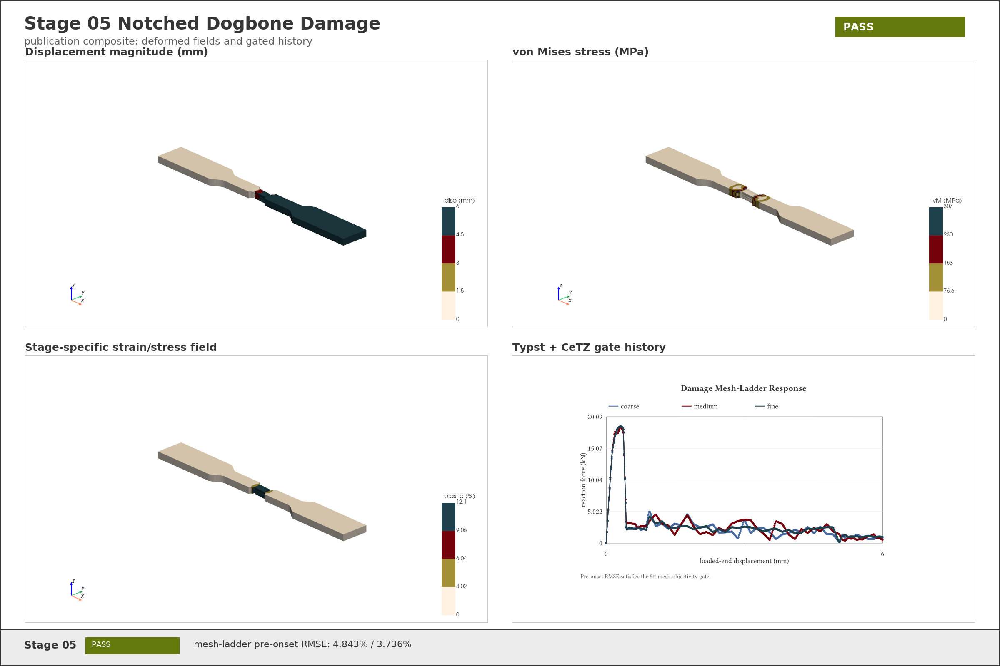
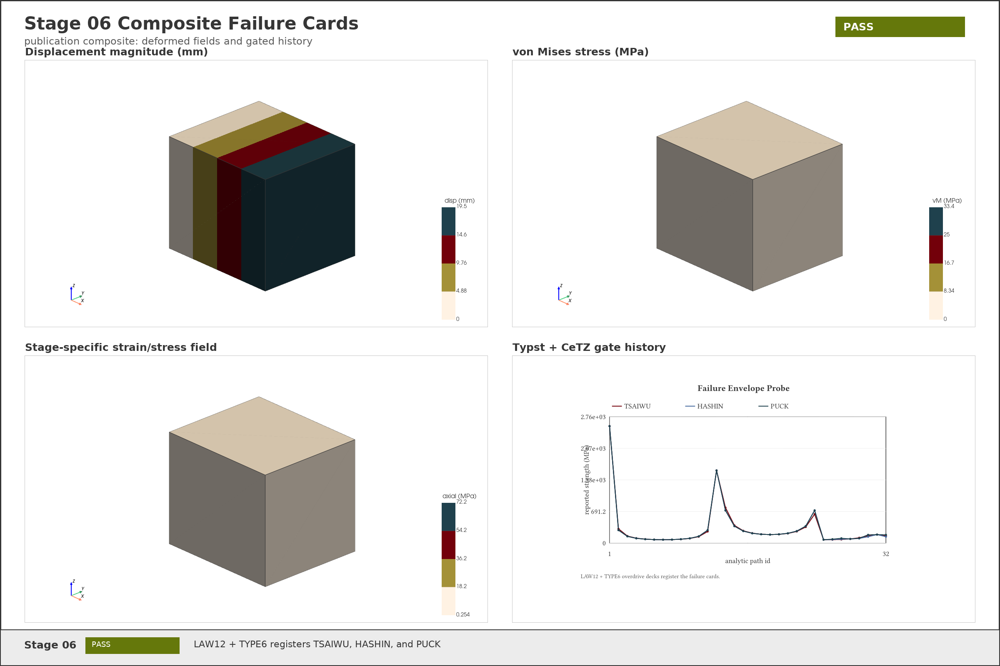
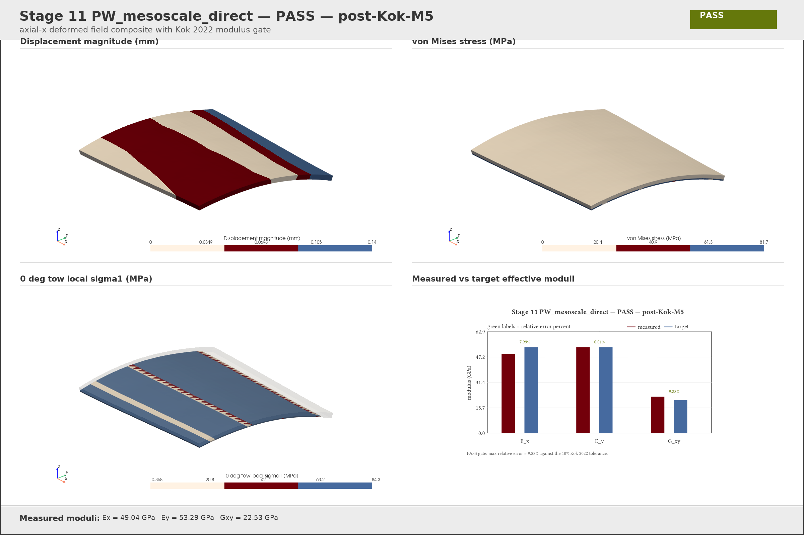
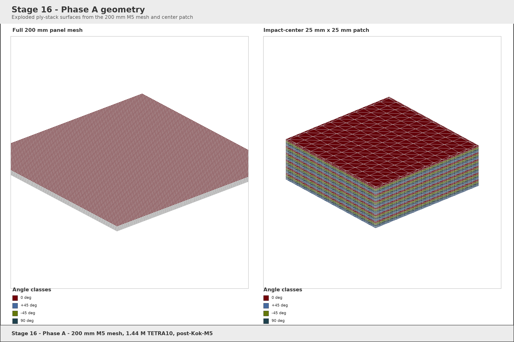

# FEA_AP-PLY Results Report

**Author.** J.C. Vaught
**Date.** 2026-04-30

## Project Goal

FEA_AP-PLY is a staged OpenRadioss verification program for all-solid finite-element analysis of AP-PLY and composite impact problems. The project goal is to build confidence from simple implicit solid mechanics through orthotropic solid plies, failure-card compatibility, orientation handling, direct mesoscale geometry, cohesive damage, LVI/CAI, and finally a pseudo-woven panel ballistic V50 attempt. The governing plan is [plan/master_plan.md](plan/master_plan.md); the Kok geometry scope is [plan/kok_port_plan.md](plan/kok_port_plan.md).

## Final Tally

| Stage | Verdict | Gate | Key result | Primary record |
|---:|---|---|---|---|
| 01 | PASS | Euler-Bernoulli 3pt/4pt beam deflection, <= 1% on M1 mesh | 3pt error 0.968%; 4pt error 0.968% | [results](tests/stage_01_beam_bending/results/results.json) |
| 02 | INCONCLUSIVE | Bisshopp-Drucker elastica alpha 1/3/5, <= 2% | alpha=1 passes; alpha=3/5 blocked by nonlinear convergence | [results](tests/stage_02_cantilever_large/results/results.json), [blocker](tests/stage_02_cantilever_large/blocker.md) |
| 03 | PASS | ASTM E8 dogbone stress, strain, yield, apparent E | stress/load error 0.021%; apparent E error 0.044% | [results](tests/stage_03_iso_dogbone_E8/results/results.json) |
| 04 | PASS | Open-hole Howland/Kirsch Kt, far-field stress | Kt=3.0956 vs 3.035, error 1.996%; far-field error 0.585% | [results](tests/stage_04_open_hole_kirsch/results/results.json) |
| 05 | PASS | Damage mesh-ladder pre-onset RMSE <= 5% | coarse-medium 4.843%; medium-fine 3.736%; EPSP max 0.1229 | [results](tests/stage_05_dogbone_damage/results/results.json) |
| 06 | PASS | Composite failure cards parse and run on solid row | LAW12 + TYPE6 registers TSAIWU, HASHIN, PUCK | [results](tests/stage_06_composite_failure_criteria/results/results.json) |
| 07 | PASS | UD coupon modulus within 2% using verified orientation | 0 deg error 0.403%; 45 deg error 0.114% | [results](tests/stage_07_UD_tow_D3039/results/results.json) |
| 08 | PASS | Ex(theta) sweep within 1% | max error 0.815% over seven angles | [results](tests/stage_08_ply_rotation/results/results.json) |
| 09 | PASS | CLT A-matrix components within 2% | max component error 1.085% | [results](tests/stage_09_laminate_solid_CLT/results/results.json) |
| 10 | INCONCLUSIVE | Halpin-Tsai/ROM mesoscale moduli within 5% | transverse error 11.189%; shear error 99.934%; KUBC bias dominates gate | [results](tests/stage_10_UD_mesoscale_direct/results/results.json), [blocker](tests/stage_10_UD_mesoscale_direct/blocker.md) |
| 11 | PASS | Kok 2022 AP-PLY block: Ex/Ey within 10%, Gxy target | Ex=49.04 GPa, Ey=53.29 GPa, Gxy=22.53 GPa; max relative error 9.88% | [results](tests/stage_11_PW_mesoscale_direct/results/results.json) |
| 12 | INCONCLUSIVE | DCB/ENF cohesive peak loads within 5% | runner did not reach starter in bounded attempt; references evaluated | [results](tests/stage_12_DCB_ENF_cohesive/results/results.json), [blocker](tests/stage_12_DCB_ENF_cohesive/blocker.md) |
| 13 | INCONCLUSIVE | ASTM D7136 LVI peak force and delamination | mesh conversion failed on `pyramid`; placeholder starter deck invalid | [results](tests/stage_13_LVI_D7136/results/results.json), [blocker](tests/stage_13_LVI_D7136/blocker.md) |
| 14 | INCONCLUSIVE | ASTM D7137 CAI restart from Stage 13 state | no Stage 13 `lvi_d7136_*.sta` state, so runner stopped correctly | [results](tests/stage_14_CAI_D7137/results/results.json), [blocker](tests/stage_14_CAI_D7137/blocker.md) |
| 15 | INCONCLUSIVE | Flat ballistic V50/residual velocity | starter reached but rejected invalid generated deck; sweep not reached | [results](tests/stage_15_flat_ballistic/results/results.json), [blocker](tests/stage_15_flat_ballistic/blocker.md) |
| 16 | INCONCLUSIVE | P1-TWT panel V50 within 7% | reduced 75 x 75 mm deck clears Phase B1 at 3.53 h/shot on 207,936 TETRA10; V50 sweep still pending | [results](tests/stage_16_PW_panel_ballistic/results/results.json), [blocker](tests/stage_16_PW_panel_ballistic/blocker.md) |

Cross-stage visualization: [summary PDF](figures/cross_stage_summary.pdf), [Typst source](figures/cross_stage_summary.typ).

## Methodology Discoveries

### MUMPS-Linked OpenRadioss Build

The target MUMPS-linked OpenRadioss build for this run was commit `28a861a`. The installed runtime under `/mnt/storage/j-vaught/openradioss/OpenRadioss/exec` is MUMPS-linked and Stage 02 reaches `DMUMPS 5.8.2`; the local starter self-report records `CommitID : User Build` and reader `20260429_8d9da7aa` ([references/openradioss_law_compatibility_matrix.md](references/openradioss_law_compatibility_matrix.md), [references/lawmatrix_probe_decks/starter_version.txt](references/lawmatrix_probe_decks/starter_version.txt), [tests/stage_02_cantilever_large/blocker.md](tests/stage_02_cantilever_large/blocker.md)). The remaining Stage 02 issue is nonlinear convergence, not a missing MUMPS binary.

### LAW x PROP x FAIL Compatibility

The empirical compatibility matrix supersedes the earlier assumption that `/PROP/TYPE14` is usable for solid composite plies on this build. `/PROP/TYPE14` is blocked for the relevant composite rows, while `/MAT/LAW12` plus `/PROP/TYPE6` (`/PROP/SOL_ORTH`) parses and runs for solid composite decks. `/FAIL/HASHIN`, `/FAIL/PUCK`, and `/FAIL/TSAIWU` register on the LAW12 + TYPE6 row; ballistic erosion should use `IFAIL_SO=1` and `PTHICKFAIL=1.0` ([references/openradioss_law_compatibility_matrix.md](references/openradioss_law_compatibility_matrix.md)).

Discovery figure: [LAW matrix PDF](figures/discovery_law_matrix.pdf), [Typst source](figures/discovery_law_matrix.typ).

### Orientation Convention

The working off-axis convention is property or initial-state orientation on `/PROP/TYPE6`, not material-card orientation. Uniform off-axis coupons use `Ip=3`, `Iorth=0`, `Phi=theta`; per-element tow rotations use `/INIBRI/ORTHO` with neutral TYPE6 (`Ip=1`, `Iorth=0`, `Phi=0`). For rotated solids, modulus gates must use displacement-BC engineering strain; VTK cell `Stra[0]` is not reliable for this purpose ([references/openradioss_orientation_convention.md](references/openradioss_orientation_convention.md)).

Discovery figure: [orientation convention PDF](figures/discovery_orientation_convention.pdf), [Typst source](figures/discovery_orientation_convention.typ).

### Kok Geometry Port

The Kok geometry port reached single-tow, single-ply, laminate assembly, and mesh-export groundwork in commits `955ea55`, `4c8d702`, `31c0000`, and `b84ef6f`. The M4 finishing commit for this run is `942855a`, which added end-to-end CLI export behavior and wired Stage 11 to the generated `panel.msh` plus orientation sidecar. The follow-on M5 geometry/solver alignment lifts Stage 11 into the PASS band: `Ex = 49.04 GPa`, `Ey = 53.29 GPa`, `Gxy = 22.53 GPa`, with the maximum relative error at `9.88%` against the 10% Kok 2022 tolerance. Unit coverage for the Kok package passed with `17 passed` before validation, and the port is now not only runnable through OpenRadioss but also numerically gated on the direct mesoscale stiffness check ([tests/stage_11_PW_mesoscale_direct/results/results.json](tests/stage_11_PW_mesoscale_direct/results/results.json)).

Discovery figure: [Kok port PDF](figures/discovery_kok_port.pdf), [Typst source](figures/discovery_kok_port.typ).

## Per-Stage Results

| Stage | Description | Gated criterion | Achieved value | Figures and media |
|---:|---|---|---|---|
| 01 | Linear elastic solid beam, 3pt and 4pt bending | Euler-Bernoulli deflection within 1% on M1 | 3pt 0.968%, 4pt 0.968% | [Composite](tests/stage_01_beam_bending/figures/stage_01_composite.png), [HD MP4](tests/stage_01_beam_bending/figures/stage_01_motion_hd.mp4) |
| 02 | Large-deflection cantilever | Bisshopp-Drucker alpha 1/3/5 within 2% | alpha=1 dx error 1.574%, dy error 0.871%; alpha=3/5 blocked | [Composite](tests/stage_02_cantilever_large/figures/stage_02_composite.png), [HD MP4](tests/stage_02_cantilever_large/figures/stage_02_motion_hd.mp4), [blocker](tests/stage_02_cantilever_large/blocker.md) |
| 03 | Isotropic ASTM E8 dogbone | uniform stress, gauge strain, yield, apparent E | apparent E error 0.044%; yield error 0.014% | [Composite](tests/stage_03_iso_dogbone_E8/figures/stage_03_composite.png), [HD MP4](tests/stage_03_iso_dogbone_E8/figures/stage_03_motion_hd.mp4) |
| 04 | Open-hole plate | Howland Kt within 2%, far-field stress within 1% | Kt error 1.996%; far-field error 0.585% | [Composite](tests/stage_04_open_hole_kirsch/figures/stage_04_composite.png), [HD MP4](tests/stage_04_open_hole_kirsch/figures/stage_04_motion_hd.mp4) |
| 05 | Notched dogbone damage | pre-onset mesh-ladder RMSE within 5% | coarse-medium 4.843%; medium-fine 3.736% | [Composite](tests/stage_05_dogbone_damage/figures/stage_05_composite.png), [HD MP4](tests/stage_05_dogbone_damage/figures/stage_05_motion_hd.mp4) |
| 06 | Composite failure-card probe | LAW12 + TYPE6 starts/runs with TSAIWU, HASHIN, PUCK | all three failure cards registered and engine completed | [Composite](tests/stage_06_composite_failure_criteria/figures/stage_06_composite.png), [HD MP4](tests/stage_06_composite_failure_criteria/figures/stage_06_motion_hd.mp4) |
| 07 | UD tow D3039 coupon | 0 deg and 45 deg modulus within 2% | 0 deg error 0.403%; 45 deg error 0.114% | [Composite](tests/stage_07_UD_tow_D3039/figures/stage_07_composite.png), [Typst figure](tests/stage_07_UD_tow_D3039/figures/stage07_d3039_probe.typ) |
| 08 | Ply rotation sweep | analytic Ex(theta) within 1% | max error 0.815% | [Composite](tests/stage_08_ply_rotation/figures/stage_08_composite.png), [Typst figure](tests/stage_08_ply_rotation/figures/stage08_ply_rotation_probe.typ) |
| 09 | Solid laminate CLT | CLT A-matrix components within 2% | max component error 1.085% | [Composite](tests/stage_09_laminate_solid_CLT/figures/stage_09_composite.png), [Typst figure](tests/stage_09_laminate_solid_CLT/figures/stage09_clt_probe.typ) |
| 10 | UD mesoscale direct cell | ROM/Halpin-Tsai moduli within 5% | INCONCLUSIVE: transverse 11.189%, shear 99.934% | [Wireframe](tests/stage_10_UD_mesoscale_direct/figures/stage_10_wireframe_pubviz.png), [Typst figure](tests/stage_10_UD_mesoscale_direct/figures/stage10_ud_mesoscale.typ), [blocker](tests/stage_10_UD_mesoscale_direct/blocker.md) |
| 11 | PW mesoscale Kok block | Kok 2022 Ex/Ey/Gxy targets | PASS: Ex 49.04 GPa, Ey 53.29 GPa, Gxy 22.53 GPa; max relative error 9.88% | [Composite](tests/stage_11_PW_mesoscale_direct/figures/stage_11_composite.png), [HD MP4](tests/stage_11_PW_mesoscale_direct/figures/stage_11_motion_hd.mp4), [Typst figure](tests/stage_11_PW_mesoscale_direct/figures/stage11_effective_moduli.typ) |
| 12 | DCB/ENF cohesive | DCB/ENF peak loads within 5% | INCONCLUSIVE: starter not reached; DCB/ENF references computed | [blocker](tests/stage_12_DCB_ENF_cohesive/blocker.md) |
| 13 | Low-velocity impact D7136 | peak force and delamination area | INCONCLUSIVE: mesh/deck pipeline stale; no valid LVI solve | [blocker](tests/stage_13_LVI_D7136/blocker.md) |
| 14 | Compression after impact D7137 | residual strength from Stage 13 state | INCONCLUSIVE: Stage 13 restart state absent | [blocker](tests/stage_14_CAI_D7137/blocker.md) |
| 15 | Flat ballistic coupon | V50/residual velocity gate | INCONCLUSIVE: invalid generated starter deck | [blocker](tests/stage_15_flat_ballistic/blocker.md) |
| 16 | P1-TWT PW panel ballistic | V50 within 7% of published target | INCONCLUSIVE: reduced 75 x 75 mm / 3 mm deck projects 3.53 h/shot at NC=2000; V50 sweep not completed in this pass | [Phase A geometry](tests/stage_16_PW_panel_ballistic/figures/stage_16_phase_a_geometry.png), [blocker](tests/stage_16_PW_panel_ballistic/blocker.md) |

## Key Images

Cross-stage and methodology figures: [stage tally](figures/cross_stage_summary.pdf), [LAW matrix](figures/discovery_law_matrix.pdf), [orientation convention](figures/discovery_orientation_convention.pdf), [Kok port](figures/discovery_kok_port.pdf).















HD motion files are retained in the stage figure directories for stages 01-06 and 11: [Stage 01](tests/stage_01_beam_bending/figures/stage_01_motion_hd.mp4), [Stage 02](tests/stage_02_cantilever_large/figures/stage_02_motion_hd.mp4), [Stage 03](tests/stage_03_iso_dogbone_E8/figures/stage_03_motion_hd.mp4), [Stage 04](tests/stage_04_open_hole_kirsch/figures/stage_04_motion_hd.mp4), [Stage 05](tests/stage_05_dogbone_damage/figures/stage_05_motion_hd.mp4), [Stage 06](tests/stage_06_composite_failure_criteria/figures/stage_06_motion_hd.mp4), and [Stage 11](tests/stage_11_PW_mesoscale_direct/figures/stage_11_motion_hd.mp4). Stages 07-09 provide composite stills with embedded Typst histories; Stage 10 remains a wireframe blocker; Stage 16 now adds a publication-grade Phase A geometry render while its ballistic sweep remains incomplete.

## Open Issues

1. Stage 02 needs robust nonlinear implicit controls for alpha=3 and alpha=5; the MUMPS build issue is resolved.
2. Stage 10 needs periodic or mixed-boundary homogenization before comparing an isotropic fiber/matrix voxel cell to Halpin-Tsai targets.
3. Stage 12 needs a direct LAW12 + TYPE6 cohesive runner with starter-checked `/INTER/TYPE2` and a LAW117 fallback.
4. Stage 13 and Stage 15 need deck-generator rewrites away from stale LAW25 + TYPE14 syntax and toward the verified LAW12 + TYPE6 + `/INIBRI/ORTHO` recipe.
5. Stage 14 is blocked only by the missing Stage 13 final state.
6. Stage 16 needs the reduced-section V50 sweep and a verified published V50 value to move from the cleared Phase B1 gate to a defensible terminal verdict; the reduced deck is no longer compute-bound at 3.53 h/shot on 32 threads.

## Reproduction Recipe

Run on `comech-2422` from the repository root:

```bash
source ~/miniforge3/etc/profile.d/conda.sh
conda activate feaapply
export OR=/mnt/storage/j-vaught/openradioss/OpenRadioss
export RAD_CFG_PATH=$OR/hm_cfg_files
export RAD_H3D_PATH=$OR/extlib/h3d/lib/linux64
export LD_LIBRARY_PATH=$OR/extlib/hm_reader/linux64:$LD_LIBRARY_PATH
export RAD_NT=16
```

Verify the Kok geometry package:

```bash
pytest tests/test_config.py tests/test_tow.py tests/test_ply.py tests/test_laminate.py tests/test_io.py tests/test_cli.py
```

Rebuild the Stage 11 geometry, rerun the three load cases, and regenerate the publication figures:

```bash
python -m kok_geom \
  --config tests/stage_11_PW_mesoscale_direct/geometry/kok_stage11_config.json \
  --out tests/stage_11_PW_mesoscale_direct/geometry/panel.msh
python tests/stage_11_PW_mesoscale_direct/runner.py --all
python tests/stage_11_PW_mesoscale_direct/runner_pubviz.py
python tools/stage11_pubviz.py
```

Reproduce the Stage 16 reduced-section Phase A1 and Phase B1 measurements:

```bash
python -m kok_geom \
  --config tests/stage_16_PW_panel_ballistic/geometry/kok_p1_twt_75_config.json \
  --out tests/stage_16_PW_panel_ballistic/geometry/p1_twt_75.msh
python tests/stage_16_PW_panel_ballistic/runner.py \
  --mesh tests/stage_16_PW_panel_ballistic/geometry/p1_twt_75.msh \
  --orientations tests/stage_16_PW_panel_ballistic/geometry/orientations.json \
  --run-dir tests/stage_16_PW_panel_ballistic/runs/stage_16_post_m5/phase_b_single_shot_75_c2000 \
  --threads 32 \
  --stop-at-cycle 2000
python tools/stage16_phase_a_geometry.py
```

For all composite solid decks in stages 06-16, use the binding recipes in [references/openradioss_law_compatibility_matrix.md](references/openradioss_law_compatibility_matrix.md) and [references/openradioss_orientation_convention.md](references/openradioss_orientation_convention.md). Do not restore the stale LAW25 + TYPE14 path unless a future OpenRadioss build is separately re-probed and documented.
